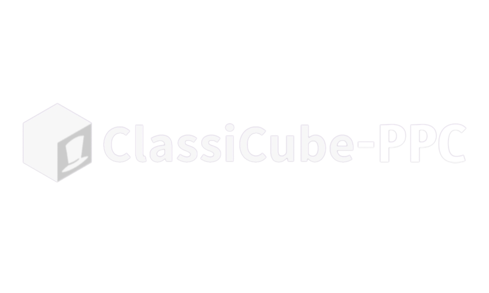

<div align="center">

 <br>ClassiCube-PPC is a folk of <a href="https://github.com/ClassiCube/ClassiCube">ClassiCube</a> for PowerMacs with Mac OS X 10.4+<br>
 **It is not affiliated with (or supported by) Mojang AB, Minecraft, or Microsoft in any way.**
</div>
<br>

# What ClassiCube is

ClassiCube aims to replicate the 2009 Minecraft Classic client while offering **optional** enhancements to improve gameplay. ClassiCube can run on [many systems](#supported-systems), including desktop, web, mobile, and even some consoles.<br>
ClassiCube is not trying to replicate modern Minecraft versions. It will never support survival, logging in with Minecraft accounts or connecting to Minecraft servers.

<details>

<summary><b>Fixes & Stuff of ClassiCube-PPC</b></summary>
*Fixed login issues for PPC<br>
*Resolved issues with downloading resources and texture packs on PPC that do not support modern SSL without needing external software or additional compilation <br>
*Applied fixes for bugs for PPC<br>
*Added a Python-based proxy server that enables the downloading of resources and texture packs to work <br>
*Updated the code from the original repository to new changes <br>
</details>

# How to play
To begin, you need to download ClassiCube-PPC.dmg, mount the DMG, move the folder named ClassiCube from the DMG to the Applications folder, then go to Applications, find the ClassiCube folder, enter the folder, and run ClassiCube.app to download the required assets from minecraft.net through a public proxy and classiCube.net.<br>
Just click 'OK' to the dialog menu that appears when you start the launcher.

**Singleplayer**
Run ClassiCube.app, then click Singleplayer at the main menu.

**Multiplayer**
Run ClassiCube.app. You can connect to LAN/locally hosted servers, and classicube.net servers if you have a [ClassiCube account](https://www.classicube.net/).

# Supported systems
ClassiCube-PPC runs on:
* Mac OS X 10.4.11 [Tested]
* Problably: Mac OS X 10.5 - 10.6 (Beta PPC)

# Compiling 
Xcode 2.2.1 - 2.5 (Mac OS X 10.4.11)<br>
```cc -fno-math-errno src/*.c src/*.m -o ClassiCube -framework Cocoa -framework OpenGL -framework IOKit -lobjc``` (Make a console version)<br>
<br>

## Documentation

Functions and variables in .h files are mostly documented.

Further information (e.g. style) for ClassiCube's source code can be found in the doc and misc folders.

#### Known compilation errors

[Fixes for compilation errors when using musl or old glibc for C standard library](doc/compile-fixes.md#common-compilation-errors)

#### Tips
* Press escape (after joining a world) or pause to switch to the pause menu.
* Pause menu -> Options -> Controls lists all of the key combinations used by the client. 
* Note that toggling 'vsync' to on will minimise CPU usage, while off will maximimise chunk loading speed.
* Press F to cycle view distance. A smaller number of visible chunks can improve performance.

* If the server has disabled hacks, key combinations such as fly and speed will not do anything.
* To see the list of built in commands, type `/client`.
* To see help for a given built in command, type `/client help <command name>`.

<details>
<summary><h2>Open source technologies (click to expand)</h2></summary>

* [curl](https://curl.se/) - HTTP/HTTPS for linux and macOS
* [FreeType](https://www.freetype.org/) - Font handling for all platforms
* [GCC](https://gcc.gnu.org/) - Compiles client for linux
* [MinGW-w64](http://mingw-w64.org/doku.php) - Compiles client for windows
* [Clang](https://clang.llvm.org/) - Compiles client for macOS
* [Emscripten](https://emscripten.org/) - Compiles client for web
* [RenderDoc](https://renderdoc.org/) - Graphics debugging
* [BearSSL](https://www.bearssl.org/) - SSL/TLS support on consoles
* [libnx](https://github.com/switchbrew/libnx) - Backend for Switch
* [Ryujinx](https://github.com/Ryujinx/Ryujinx) - Emulator used to test Switch port
* [wut](https://github.com/devkitPro/wut/) - Backend for Wii U
* [Cemu](https://github.com/cemu-project/Cemu) - Emulator used to test Wii U port
* [libctru](https://github.com/devkitPro/libctru) - Backend for 3DS
* [citro3D](https://github.com/devkitPro/citro3d) - Rendering backend for 3DS
* [Citra](https://github.com/citra-emu/citra) - Emulator used to test 3DS port
* [libogc](https://github.com/devkitPro/libogc) - Backend for Wii and GameCube
* [libfat](https://github.com/devkitPro/libfat) - Filesystem backend for Wii/GC
* [Dolphin](https://github.com/dolphin-emu/dolphin) - Emulator used to test Wii/GC port
* [libdragon](https://github.com/DragonMinded/libdragon) - Backend for Nintendo 64
* [ares](https://github.com/ares-emulator/ares) - Emulator used to test Nintendo 64 port
* [BlocksDS](https://github.com/blocksds/sdk) - Backend for Nintendo DS
* [melonDS](https://github.com/melonDS-emu/melonDS) - Emulator used to test Nintendo DS port
* [vitasdk](https://github.com/vitasdk) - Backend for PS Vita
* [Vita3K](https://github.com/Vita3K/Vita3K) - Emulator used to test Vita port
* [pspsdk](https://github.com/pspdev/pspsdk) - Backend for PSP
* [PPSSPP](https://github.com/hrydgard/ppsspp) - Emulator used to test PSP port
* [PSL1GHT](https://github.com/ps3dev/PSL1GHT) - Backend for PS3
* [RPCS3](https://github.com/RPCS3/rpcs3) - Emulator used to test PS3 port
* [ps2sdk](https://github.com/ps2dev/ps2sdk) - Backend for PS2
* [PCSX2](https://github.com/PCSX2/pcsx2) - Emulator used to test PS2 port
* [PSn00bSDK](https://github.com/Lameguy64/PSn00bSDK/) - Backend for PS1
* [duckstation](https://github.com/stenzek/duckstation) - Emulator used to test PS1 port
* [libxenon](https://github.com/Free60Project/libxenon) - Backend for Xbox 360
* [nxdk](https://github.com/XboxDev/nxdk) - Backend for Xbox
* [xemu](https://github.com/xemu-project/xemu) - Emulator used to test Xbox port
* [cxbx-reloaded](https://github.com/Cxbx-Reloaded/Cxbx-Reloaded) - Emulator used to test Xbox port
* [KallistiOS](https://github.com/KallistiOS/KallistiOS) - Backend for Dreamcast
* [GLdc](https://github.com/Kazade/GLdc) - Basis of rendering backend for Dreamcast
* [flycast](https://github.com/flyinghead/flycast) - Emulator used to test Dreamcast port
* [libyaul](https://github.com/yaul-org/libyaul) - Backend for Saturn
* [mednafen](https://mednafen.github.io/) - Emulator used to test Saturn port

</details>

## Sound Credits
ClassiCube uses sounds from [Freesound.org](https://freesound.org)<br>
Full credits are listed in [doc/sound-credits.md](doc/sound-credits.md)

## Credits
ClassiCube [SourceCode](https://github.com/ClassiCube/ClassiCube)<br>

